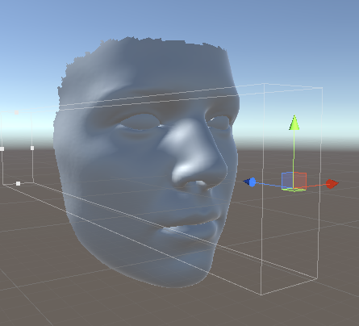

#3DMM Unity

Simple example to control 3DMM face using UDP on Unity.

#Pipeline
Unity reads 3dmm basis, and set up a UDP server to receive expression parameters.
A simple python program to send expression parameters. And the unity will received it to render the face.

#Set up
Set up face index in Unity. 
1. Open Folder with Unity, also pycharm with folder
2. Check Extract Index(script) in Unity under "face/default" object.
3. Uncheck DMM(script) in Unity under "face/default" object.
4. Run Unity, and wait it finish. [remember to correct the path]
5. Close Unity, run Match function in python script.[This needs quite a long time]

# Run
1. Open Folder with Unity, also pycharm with folder
2. Uncheck Extract Index(script) in Unity under "face/default" object.
3. Check DMM(script) in Unity under "face/default" object.
4. Run UDP_send in python script.
5. You will note the face expression in Unity will be changed.[you can change the camera correspondingly]

#Test platform
This code is very simple, should be compatible with any version. However, my pc is using Vs2019 + Python 3 + Unity 2019.3.0f6

